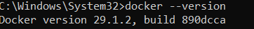
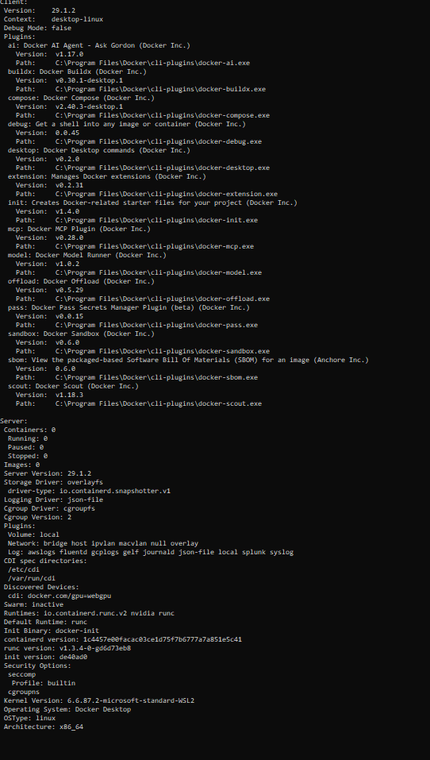
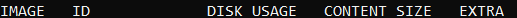
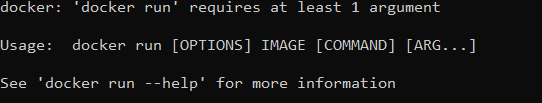
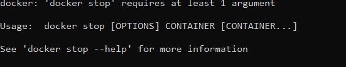
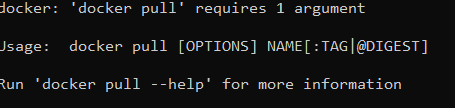
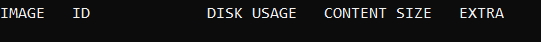
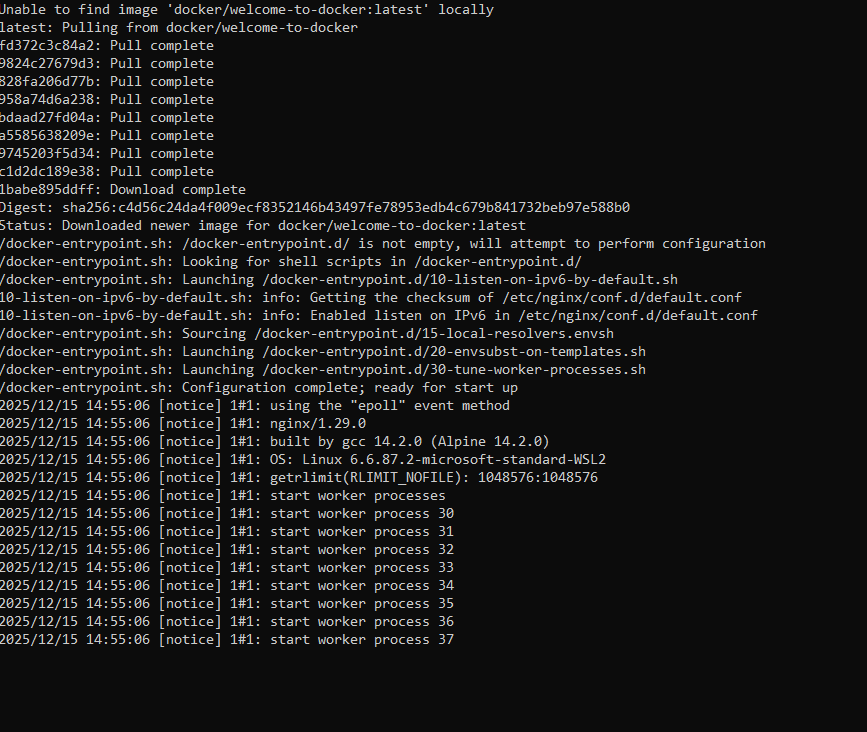
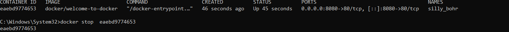
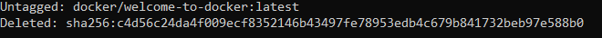

○ Conteneur spécifique   	        docker rm <ID>
○ Plusieurs conteneurs          	docker rm <ID1> <ID2>
○ Tous les conteneurs arrêtés	    docker container prune
○ Forcer un conteneur actif	        docker rm -f <ID>
○ Image spécifique	                docker rmi <IMAGE_ID>
○ Plusieurs images	                docker rmi <IMAGE1> <IMAGE2>
○ Toutes les images inutilisées	    docker image prune
○ Toutes les images non utilisées	docker image prune -a
○ Forcer suppression d’une image	docker rmi -f <IMAGE_ID>
